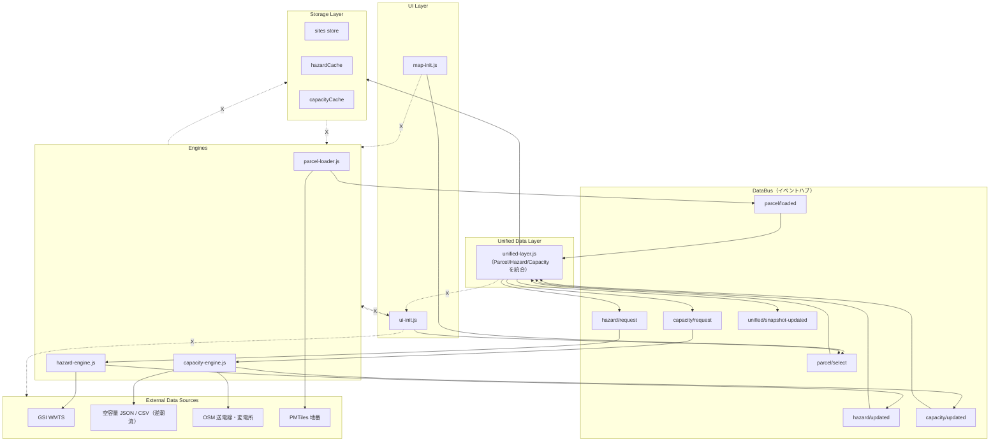

# AI Assistant Guide  
**（AIアシスタント向け補助ドキュメント / Version 0.1）**

このドキュメントは、このリポジトリを操作・改修する  
**AI アシスタント（ChatGPT / Claude / Gemini / Copilot など）**  
のための「追加前提」「禁止事項」「作業テンプレート」をまとめたものです。

README は“人間開発者向け”のため、AI に必要な前提知識・仕様・注意点は本ファイルを参照すること。


---

# 1. プロジェクト概要（AI向けの要約）

本プロジェクトは、  
**系統用蓄電池（BESS）用地の評価に必要な「ハザード × 地番 × 空容量 × 農地」情報を、ブラウザ上で高速可視化する GIS Viewer（MapLibreベース）**  
を構築するものである。

主なデータソース：

- GSI（国土地理院）「重ねるハザードマップ」WMTS  
- 電力会社（例：TEPCO）「空容量マップ」PDF/CSV  
- eMAFF 農地ナビ（農地ポリゴン）  
- 独自の農地パネル入力（IndexedDB 保存）

AI アシスタントは、この前提・目的を常に念頭に置いて回答・生成を行うこと。


---

# 2. データソースの前提と制限

## 2.1 GSI ハザード（WMTS）

### ✔ 正しいレイヤー識別子、URL、TileMatrixSet を使用すること  
（metadata_light.xml から抽出した正式仕様に従う）

### ✔ 凡例や色分けを勝手に改変してはいけない  
UI 改変時も必ず公式色に準拠する。

### ✔ ズーム制限（例：z4～のレイヤー）を守ること  
必要に応じて hazardMatrix.js に反映する。

---

## 2.2 電力会社「空容量マップ」

出典：空容量マップ利用上の留意点（例：TEPCO PDF）

### ✔ 表示される空容量は「逆潮流側（売電方向）」のみ  
順潮流（充電方向）の空容量は示されない。

### ✔ 緑・赤・青（またはピンク・紫）は“出力制御可能性含む”  
Viewer UI の凡例・文言は誤解を生まない設計にすること。

### ✔ 3年以内の増強系統は負担金遡りの可能性  
データに「増強予定」フラグを持たせ、UI でも注意喚起。

### ✔ 過去の空容量マップは取得不可  
履歴は**プロジェクト側で自前保存が必要**（PMTiles化など）。

### ✔ 逆潮流以外のシステム情報は誤って表示しない  
「この Viewer は逆潮流空容量マップの可視化である」と明記する。

---

# 3. ディレクトリ構成（AI向け注意点）

AI アシスタントは次を厳守する：

- **viewer/** … UI・MapLibre・レイヤー管理のメイン領域  
- **data/** … hazardMatrix / powerMatrix / geojson など  
- **tools/** … 生成スクリプト（hazardMatrix-generator.js 等）

✔ 原則として **viewer/main.js を肥大化させない**  
✔ 分割方針（Phase4.3 の Cプラン）に従う  
　- map-init.js  
　- hazard-init.js  
　- power-init.js  
　- ui-init.js  
　など責務別に分離する。

---

# 4. AIアシスタントが絶対に守るべきルール

## 4.1 技術仕様の“創作”禁止  
- 電力会社の仕様  
- GSI の凡例  
- 法律・条例  
- データ更新頻度  
などは**勝手に補完・推測しない**。

## 4.2 ファイル名・ディレクトリ名を勝手に変更しない  
変更が必要な場合は  
**理由 → 影響範囲 → 具体案**  
を提示し、必ず人間の承認を得る。

## 4.3 ハザードレイヤー ID を勝手に作らない  
GSI の Identifier のみ使用。

## 4.4 空容量マップの色分けを再解釈しない  
常に電力会社の凡例に準拠して説明する。

## 4.5 MapLibre の表示順序を変更するときは必ず説明する  
（重要レイヤーが消える事故を防止）

---

## 🧩 **アーキテクチャ依存ルール（AI 必読 / Segment4）**

このプロジェクトでは、
AI が誤った依存方向のコードを生成しないよう、
**明確な依存関係マップ（Allowed / Forbidden）を定義** しています。

---

### 🔷 **詳細アーキテクチャ図（Mermaid：AI向け厳密版）**



---

### 🔶 **ASCII 依存境界図（AIが誤解しないための冗長版）**

```txt
=========================================================
SRHD Hazard Viewer - Dependency Structure (AI Strict Mode)
=========================================================

UI LAYER (viewer/ui-init.js, viewer/map-init.js)
    |
    v
DATA BUS (EventEmitter)
    |
    v
UNIFIED DATA LAYER (viewer/unified/unified-layer.js)
    |
    +--> hazard/request
    +--> capacity/request
    |
    v
ENGINES (viewer/engines/*.js)
    |
    v
EXTERNAL DATA SOURCES
    - GSI WMTS  (metadata_light.xml)
    - 空容量 JSON / CSV（逆潮流）
    - OSM 送電線・変電所
    - PMTiles 地番
    |
    ^
    |
STORAGE LAYER (IndexedDB: sites / hazardCache / capacityCache)
    <-- write/read ONLY via UnifiedLayer

---------------------------------------------------------
Forbidden (AI must NEVER generate):
---------------------------------------------------------
UI        -> Engines
Engines   -> UI
Engines   -> Storage
Storage   -> Engines
UI        -> External
UDL       -> UI
---------------------------------------------------------
Allowed:
UI -> DataBus -> UDL -> Engines -> External
UDL -> Storage
=========================================================
```

---

## 🧠 **AIが遵守すべきルール（追加版）**

1. **UnifiedLayer を中心とする依存方向を絶対に乱さないこと**
2. **UI から Engine を呼ぶコードを生成するのは禁止**
3. **Engine が Storage を直接操作してはいけない**
4. **Storage（IndexedDB）は UnifiedLayer 経由でのみアクセス可能**
5. **EventBus のイベント名を勝手に作らない／改変しないこと**
6. **UDL スキーマ（UnifiedSiteSnapshot）を勝手に変更しないこと**
7. **GSI レイヤー識別子は metadata_light.xml の公式値のみ使用すること**
8. **空容量は“逆潮流側”と明記されたもののみを扱う（誤補完禁止）**

---
## 🔥 AI向け：レイヤー／ファイル責務の厳密定義（破ったらバグ確定）

---

# 1. UI Layer（viewer/ui-init.js / viewer/map-init.js）

### Allowed（許可）

* DataBus にイベント発火
* snapshot-updated を購読
* 地図・UI・パネル操作

### Forbidden（禁止）

* `import hazard-engine.js` → ❌
* `import capacity-engine.js` → ❌
* `import unified-layer.js` → ❌

### 理由

UI と Engine が依存すると**循環依存**が発生し、Viewer が壊れる。

---

# 2. DataBus（viewer/bus.js）

### Allowed

* イベントの送受信のみ
* ロジック不可

### Forbidden

* 計算ロジック
* 複雑な状態保持
  ※ DataBus は “電文配達係” であり、頭脳ではない。

---

# 3. Unified Data Layer（viewer/unified/unified-layer.js）

### Allowed

* Parcel / Hazard / Capacity の統合
* IndexedDB への保存・読込
* Engine への要求（hazard/request など）

### Forbidden

* UI 更新
* 地図操作
* 外部 API の直接アクセス
* Engine のロジックを取り込む
* hazard-engine.js や capacity-engine.js の責務を奪う

### Must Have

* `UnifiedSiteSnapshot` を壊さない
* dataDate チェック
* snapshot-updated の発行

---

# 4. Engines（viewer/engines/*.js）

### Allowed

* ハザード判定
* 空容量判定
* 外部データ取得（WMTS / JSON / PMTiles）

### Forbidden

* UI 更新
* IndexedDB アクセス
* 他 Engine を直接呼ぶ
* UnifiedLayer のロジックを取り込む

---

# 5. Storage Layer（viewer/storage/indexeddb.js）

### Allowed

* UDL からの save/get の指示を処理

### Forbidden

* UI と直接通信
* Engine から直接触ること

---

# 6. External Data Sources

AI は以下を守ること：

* GSIレイヤーIDは metadata_light.xml の公式値のみ使用する
* 空容量データは “逆潮流側” のみ扱う
* 電力会社凡例の再解釈禁止
* 農地データの地目分類を勝手に創作しない

---

# 🔒 グローバル禁止事項（AIルール）

```txt
UI        -> Engine        禁止
Engine    -> UI            禁止
Engine    -> Storage       禁止
Storage   -> Engine        禁止
UI        -> External      禁止
UDL       -> UI            禁止

Allowed:
UI -> DataBus -> UDL -> Engine -> External
UDL -> Storage
```
---

# 5. よくあるタスクとテンプレート

## 5.1 hazardMatrix.js の更新依頼テンプレ

```

以下を前提に hazardMatrix.js を再生成してください：

* docs/ai-assistant-guide.md のハザード仕様をすべて遵守
* metadata_light.xml の正式識別子・URLを使用
* レイヤーは洪水/内水/高潮/津波/土砂/雪崩をカテゴリ構造で整理
* zoom レベル制限も反映

```


## 5.2 UI 改善指示のテンプレ

```

Google Maps 風UIに準拠しながら、viewer/ui-init.js を改修。
必ず以下を守ること：

* スケールは中央下部
* ゴミ箱 > ズーム > 現在地ボタンの縦配置
* hazardパネルはカテゴリごとに反転スイッチ
* 触るのは ui-init.js のみ。他の init ファイルへ影響を出さない

```

---

## 5.3 コード生成時の注意

- ES Modules を正しく使用  
- import パスは相対パスで正しく  
- 必ず動くコードを出力し、「省略」を使わない  
- コメントで責務を書く  
- 再生成しても壊れない idempotent な内容にする  

---

# 6. フェーズ管理（Phase5-D 版）

現在フェーズ：**Phase5-D**

- Segment1：仕様整理（完了）  
- Segment2：hazardMatrix.js 再生成  
- Segment3：UI 刷新  
- Segment4：農地×ハザード×空容量統合  

AI アシスタントは、回答する際に **“今どのフェーズのタスクなのか” を必ず認識すること。**

---

# 7. ライセンス・利用データの注意

- GSI：使用条件あり（必ず原典に従う）  
- 電力会社：空容量マップは引用の範囲で使用（再配布不可）  
- プロジェクト内のデータの扱いはすべて慎重に行う  

---

**以上が AI アシスタント向け補助ドキュメントの初期版です。**  
今後のフェーズ進行に合わせてバージョンアップする。
```
